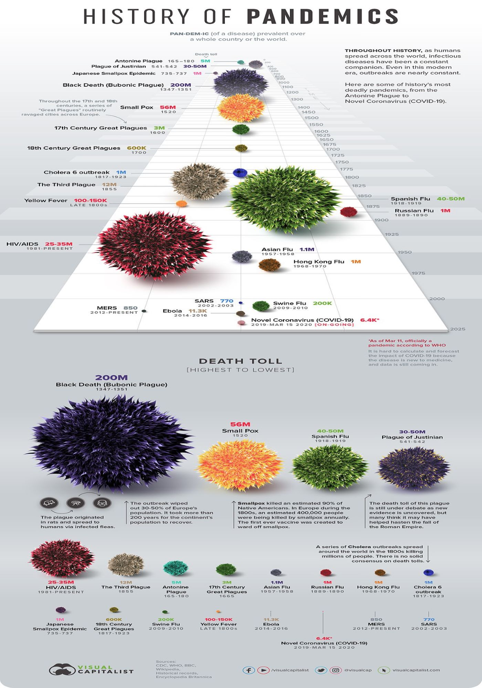

<style type = "text/css">

h1.title {color: brown}

</style>

***
 _Jared Klug_, _David Nemirovsky_, _Matthew Lawlor_ _and_ _Purnima Sharma_ 

<brk><brk><brk>

## *Overview*

According to [Google Trends](https://trends.google.com/trends/story/US_cu_4Rjdh3ABAABMHM_en), "coronavirus" is one of the most researched topics of 2020, having been searched four times as much as "news" between March and May of 2020. As we live through this ongoing pandemic, what might the most googled phobia be? Due to COVID-19, it is ["the fear of other people"](https://nypost.com/2020/10/15/most-googled-phobia-of-2020-is-fear-of-other-people-amid-covid-19/
). So, a likely question on most peoples' minds is how would COVID-19 take its course in the near future and possibly beyond?

<center>
<figure>

<figcaption> Coronavirus in comparison to history's deadliest pandemics, as of March 15, 2020 [[1]](https://dailymail.co.uk/news/article-8120631) </figcaption>
</figure>
</center>

***

Given the nature of new Zoonotic infectious diseases, and the resulting inconsistent and sometimes conflicting measures of management of COVID-19 by the current federal government, we thought it would be interesting to explore into past pandemics in an effort to read into the current one. By looking at any prevalent patterns and similarities of prior pandemics, the aim was to learn lessons from those and shed some light on the direction of COVID-19.    

****** embed screencast here*************

Data for the project was collected from various online sources such as [kaggle.com](https://www.kaggle.com), [cdc.gov](https://www.cdc.gov/datastatistics/), and [WHO.int/data](https://www.who.int/data/) for covid19 data. For a complete list of datasets and descriptions, click on the  "Datasets" tab above.


Data comparisons for the project were performed between past pandemics and the current pandemic using similar and parallel, if possible, datasets (in terms of time-frame and geography of the spread). Comparisons were made by analyzing visuals and statistical parameters between the current and past pandemics. 


The below plots show updated COVID-19 U.S. new versus cumulative cases and deaths. Death data is updated weekly, whereas case data is updated daily. The start of the pandemic duration was set to be January 22, 2020 (the first confirmed case in the U.S.).


```{r setup, include=FALSE}
knitr::opts_chunk$set(echo = TRUE, warning = FALSE, message = FALSE)

library(tidyverse)
library(plotly)
load("rdas/covid_us_cases.rda")
load("rdas/covid_us_deaths.rda")

covid_us_merged = 
  full_join(covid_us_cases, covid_us_deaths) %>% 
  arrange(pandemic_duration) %>% 
  relocate(pandemic_duration, covid_new_cases, covid_new_deaths) %>% 
  pivot_longer(
    covid_new_cases:covid_new_deaths, 
    names_to = "new",
    names_prefix = "covid_", 
    values_to = "new_count") %>% 
  mutate(
    new = recode(new,
                 new_cases = "New Cases",
                 new_deaths = "New Deaths")
  ) %>% 
  pivot_longer(
    covid_cumulative_cases:covid_cumulative_deaths, 
    names_to = "cumulative",
    names_prefix = "covid_", 
    values_to = "cumulative_count") %>% 
  mutate(
    cumulative = recode(cumulative,
                 cumulative_cases = "Cumulative Cases",
                 cumulative_deaths = "Cumulative Deaths")
  )
  
plot_new = 
covid_us_merged %>% 
   drop_na() %>% 
   plot_ly(
    x = ~pandemic_duration, y = ~new_count, type = "scatter", mode = "lines", color = ~new) %>% 
   layout(title = "COVID-19 U.S. New Cases and Deaths",
          xaxis = list(title = "Pandemic Duration"), 
          yaxis = list(title = "Count"))

plot_cumulative = 
covid_us_merged %>% 
   drop_na() %>% 
   plot_ly(
    x = ~pandemic_duration, y = ~cumulative_count, type = "scatter", mode = "lines", color = ~cumulative) %>% 
   layout(title = "COVID-19 U.S. New vs Cumulative Cases and Deaths",
          xaxis = list(title = "Pandemic Duration"), 
          yaxis = list(title = " "), 
          legend = list(x = 100, y = 0.5))

subplot(plot_new, plot_cumulative, shareX = T, titleY = T)
```
